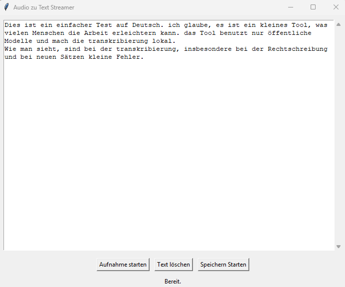

# VoiceToText

A simple Windows tool to record audio by mouse click or hotkey, convert it to text, and copy the recognized text to the clipboard with one click.


## Features

- Start/stop recording via mouse button or Shift key
- Automatic speech recognition (speech-to-text)
- Display of recognized text in the window
- Copy text to clipboard with a button
- Save text to a file with one click
- Multilanguage support (German/English) via `lang` dictionary

## Requirements

- Python 3.8+
- sounddevice
- soundfile
- whisper (or another speech-to-text module)
- tkinter (included with Python)
- pyperclip (for clipboard support)

Install the required packages with:

```bash
pip install sounddevice soundfile pyperclip
# For Whisper:
pip install git+https://github.com/openai/whisper.git
```

## Usage

1. Start the program:
   ```bash
   python voiceToText.py
   ```
2. Click **"Start recording"** or hold the **Shift key** to begin recording.
3. Release to stop recording; the recognized text will be displayed.
4. Click **"Copy text"** to copy the recognized text to the clipboard.
5. Click **"Save"** to save the recognized text to a file of your choice.

## Notes

- Language and all UI texts can be changed centrally in the `lang` dictionary.
- For best results, use an external or built-in microphone.

---

*This tool is intended for private use and as an example for simple speech-to-text applications.*